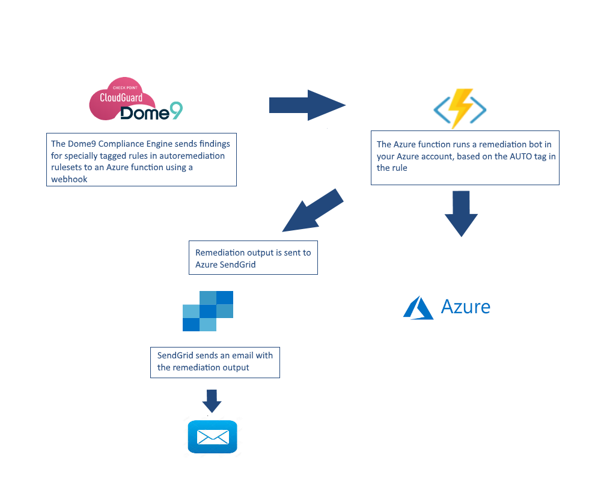

  - [What are Dome9 CloudBots?](#what-are-dome9-cloudbots)

    

    <h1><a target="_blank" href="https://cloudbots.dome9.com">CloudBots</a> is an automatic remediation solution for public cloud platforms (Azure, <a href="https://github.com/Dome9/cloud-bots" targe="_blank">AWS</a>, and <a href="https://github.com/Dome9/cloud-bots-gcp" targe="_blank">GCP</a>)</h1>

  - [Flow Diagram](#flow-diagram)
      - [The Bots](#the-bots)
  - [Deploy the CloudBots to your Azure
    accounts](#deploy-the-cloudbots-to-your-azure-accounts)
      - [Setup your Azure subscriptions for
        CloudBots](#setup-your-azure-subscriptions-for-cloudbots)
      - [Multiple Accounts](#multiple-accounts)
  - [Setup your Dome9 account](#setup-your-dome9-account)
      - [Configure the rules](#configure-the-rules)
      - [Configure a Continuous Compliance
        policy](#configure-a-continuous-compliance-policy)
  - [Update the CloudBots code](#update-the-cloudbots-code)
  - [Log Collection for
    Troubleshooting](#log-collection-for-troubleshooting)
  - [What are Dome9 CloudBots?](#what-are-dome9-cloudbots)
      - [Flow Diagram](#flow-diagram)
          - [The Bots](#the-bots)
      - [Onboarding](#onboarding)
          - [Setup your Azure account for
            CloudBots](#setup-your-azure-account-for-cloudbots)
          - [Multiple Accounts](#multiple-accounts)
      - [Setup your Dome9 account](#setup-your-dome9-account)
          - [Configure the rules](#configure-the-rules)
          - [Configure the Continuous Compliance
            policy](#configure-the-continuous-compliance-policy)
      - [Log Collection for
        Troubleshooting](#log-collection-for-troubleshooting)

## What are Dome9 CloudBots?

Cloud-Bots is an auto remediation solution for Azure, built on top of
the CloudGuard Dome9 Continuous Compliance capabilities.

They can also be used standalone, without Dome9, to remedy issues in AWS
accounts. Details are included how to configure and trigger them.

# Flow Diagram

## The Bots

Refer to [this](dome9CloudBots/bots/bots.md) file for a list of the
bots, what each one does, and an example of a rule that could be used to
trigger it.

# Deploy the CloudBots to your Azure accounts

To use the CloudBots in your Azure accounts, you must setup your account
and your Dome9 account.

## Setup your Azure subscriptions for CloudBots

Follow these steps to configure your Azure subscriptions to use Dome9
CloudBots:

  - Install packages needed by the Cloudbots
  - Create a new Azure app registration for CloudBots
  - Optionally, create a SendGrid account to forward email notifications
  - Assign IAM roles for the app registration created above
  - Create an Azure function for the CloudBots
  - Deploy the CloudBots in the Azure subscription

<!-- end list -->

1.  Install Dependencies

    **Note:** If you already have Azure CLI and Azure functions make sure to use the latest versions
    1.  [Azure
        CLI](https://docs.microsoft.com/en-us/cli/azure/install-azure-cli?view=azure-cli-latest),
        and then login to your Azure account
    2.  [Docker](https://www.docker.com)
    3.  [Azure Functions Core
        Tools](https://github.com/Azure/azure-functions-core-tools)
    4.  [Python 3.6.X](https://www.python.org/)
    5.  [NodeJS \> 8.5](https://nodejs.org/en/download)
    6.  [Microsoft .NET core
        \> 2.2](https://dotnet.microsoft.com/download/dotnet-core)

2.  Create Azure App Registration:
    
    1.  In the Azure portal, navigate to App registrations, and the
        click *New registration*.
    2.  Enter a name for the app (for example, *dome9CloudBots*), then
        click *Register*.
    3.  Save the *Application (client) ID* and *Directory (tenant) ID*.
    4.  Navigate to *Certificates & secrets*, from the left side menu,
        and click *New client secret* and click *Add*
    5.  Enter the secrets, saved in the previous step, in *Client
        secrets*.

3.  Create SendGrid, to be used to send remediation outputs by email
    (Optional)
    
    1.  In the Azure portal, navigate to *SendGrid Accounts*.
    2.  Click *Add*, and complete the signup form.
    3.  Select the new SendGrid account, and then click *Manage*.
    4.  Select *Settings -\> API Keys*, and then click *Create API Key.*
    5.  Enter a name (for example, *dome9CloudBots*), select *Full
        Access*, then click *Create & View*.
    6.  Save the key value (will be needed in a later step).

4.  Assign Roles
    
    1.  Navigate to *Subscriptions*.
    2.  Select the subscription that will use the CloudBots.
    3.  Select *Access control (IAM)* from the menu on the left.
    4.  Click *Add* -\> *Add role assignment*
    5.  Complete the form, using following:
          - Role: Contributor
          - Select: select the App Registration from step 2, above.
    6.  Click *Save*.
    7.  Repeat these steps for each additional Subscription.

5.  Create an Azure Function App
    
    1.  Navigate to *Function App*.
    2.  Click *Add*.
    3.  Complete the form with the following (all other values - leave
        the default):
          - App name: dome9CloudBots
          - Resource Group: use the name from step 2, above.
          - OS: Linux
          - Runtime Stack: Python
    4.  Click *Create*.

6.  Deployment
    
    1.  Clone the CloudBots Azure code from
        [GitHub](https://github.com/Dome9/cloud-bots-azure)
    
    2.  Navigate to the locally cloned CloudBots directory and run the
        following command: `func init --docker`
    
    3.  Select *Python*.
    
    4.  Deploy the code to the remote Function App (this could take a
        while). Run the following command, replacing ${functionAppName}
        with the Function App name that was given in the previous step
        (5 (v)): `func azure functionapp publish ${functionAppName}`
        Save *invoke URL* which will appear after the successful execution of this command.
        This URL will be used as http endpoint in Dome9 remediation configuration.
    
    5.  In the Azure portal, navigate to the Function App and then to
        *Configuration*.
    
    6.  Set the following environment variables. Click *New application
        settings* and repeat for each item:
        
        Name: SECRET Value: enter the value from step 2 (v)
        
        Name: TENANT Value: enter the value from step 2 (iii)
        
        Name: CLIENT\_ID Value: enter the value from step 2 (iii)
        
        Name: SEND\_GRID\_API\_CLIENT Value: enter the value from step 3
        (vi)
        
        Name: OUTPUT\_EMAIL Value: enter email address
        
        Name: SEND\_LOGS Value: True to enable logging to Dome9, False
        to disable logging
    
    7.  Click *Save*.

## Multiple Accounts

If you are deploying CloudBots on several Azure subscriptions, repeat
step 4 (Assign Roles), above, for each subscription.

# Setup your Dome9 account

On Dome9 you must add remediation tags to rules in a compliance ruleset.

## Configure the rules

Follow these steps in your Dome9 account to tag the compliance rules &
rulesets to use bots as a remediation step.

1.  In the Dome9 web app, navigate to the Rulesets page in the
    Compliance & Governance menu.

2.  Select or create a ruleset that will be used for the cloudbots.

3.  Select the rules for which you want to add a remediation step.

4.  In the Compliance Section add a row with the following string:
    `AUTO: <bot-name> <params>` where *bot-name* is the name of the bot,
    and *params* is a list of arguments for the bot (if any).
    Default separator between params is "-".
    For example, `AUTO: ec2_virtual_machine_stop` will run the bot to
    stop an EC2 instance.
    Or, `AUTO: delete_network_security_group_single_rule 22 - - - Allow`
    will run the bot to delete rule from NSG with destination port 22
    and action "Allow".

## Configure a Continuous Compliance policy

Once the rules in the ruleset have been tagged for remediation, set up a
Continuous Compliance policy to run the ruleset, and send findings the
Azure function webhook.

1.  Navigate to the **Policies** page in the Compliance & Governance
    menu.
2.  Click **ADD POLICY** (on the right).
3.  Select the account from the list, then click **NEXT**, this will be
    the one account in which the bots are deployed.
4.  Select the ruleset from the list, then click **NEXT**.
5.  Click **ADD NOTIFICATION**.
6.  Select *Send to HTTP Endpoint* and enter the URL from the Function
    App and then click **SAVE**.

**Note:** Dome9 will send event messages to the webhook for new
findings. To send events for previous findings, follow these steps:

1.  Navigate to the **Policies** page.
2.  Find the ruleset and account in the list, and hover over the right
    of the row, then click on the *Send All Alerts* icon.
3.  Select the *webhook* Notification Type option, and the Notification
    Policy (the one created above), then click **SEND**. Dome9 will send
    event messages to the Azure function webhook.

# Update the CloudBots code

**Note:** Make sure to use the latest versions of Azure CLI and Azure functions 
1.  Deployment
    1.  Clone the CloudBots Azure code from
        [GitHub](https://github.com/Dome9/cloud-bots-azure)
    2.  Navigate to the locally cloned CloudBots directory and run the
        following command: `func init --docker`
    3.  Select *Python*.
    4.  Deploy the code to the remote Function App (this could take a
        while). Run the following command, replacing ${functionAppName}
        with the Function App name that was given in the previous step
        (5 (v)): `func azure functionapp publish ${functionAppName}`

# Log Collection for Troubleshooting

The cloudbots send log information to Dome9, that is used for
troubleshooting. By default, this is enabled for all bots. You can
disable this in your Azure account. Select the function, and set the
environment variable SEND\_LOGS to False. This will apply to all bots in
the account. By default, this is set to True, enabling logs.

Each account is controlled by the variable for the function configured
in that account.
